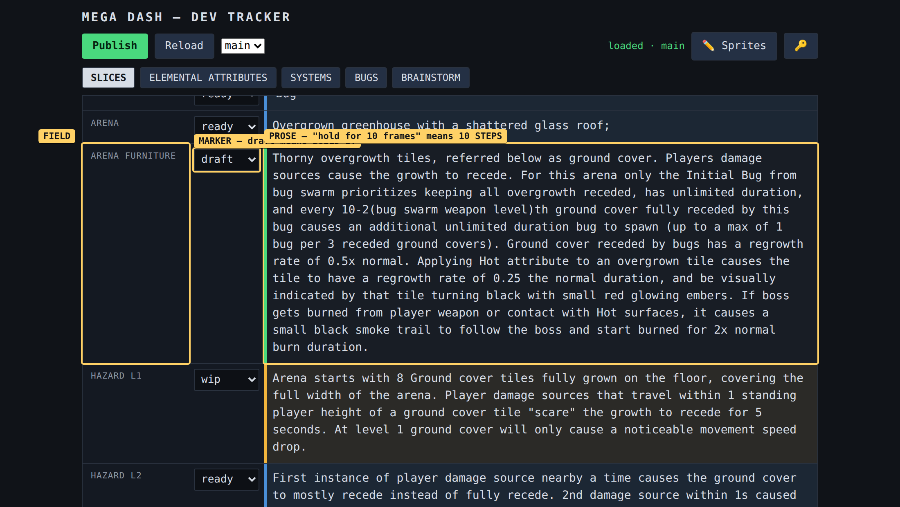
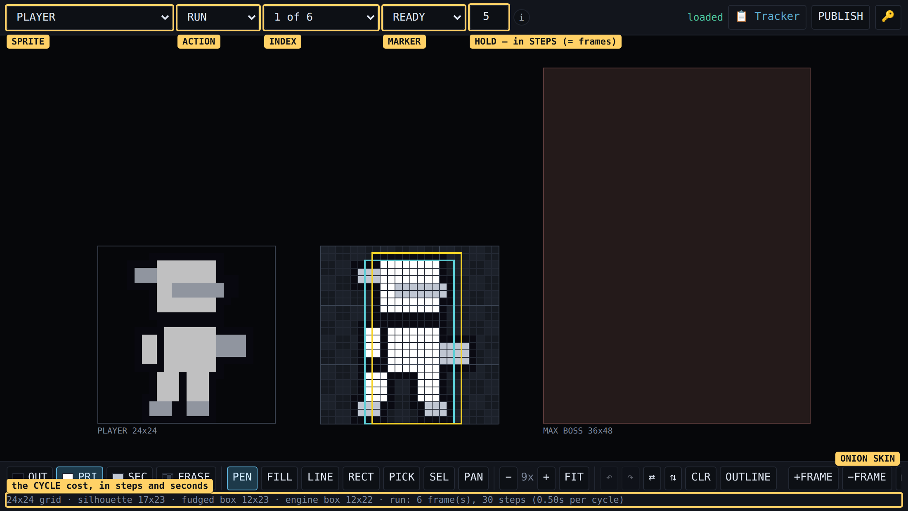

# MEGA DASH — GLOSSARY

The vocabulary the tracker, the sprite editor and the code all use. If a word here
means something different in a field you are writing, the word is wrong, not the field.

---

## FRAMES ARE STEPS. This is the alias, and it is the important line on the page.

**When you write "hold for 10 frames" in a tracker field, you mean 10 STEPS**, and the
code will read it that way. Both words point at the same unit: **one 1/60th of a second
of the game's simulation clock.**

They are aliases because the game must play identically at any refresh rate. A 120Hz
phone paints twice as often as a 60Hz one, and if "frame" ever came to mean "one repaint"
the same animation would run at half speed on half the devices. So the game has exactly
one clock, every duration is counted in it, and the screen just shows whatever the clock
has reached.

| you might write | it means |
|---|---|
| 10 frames | 10 steps = 1/6 second |
| 30 frames | 30 steps = half a second |
| 60 frames, 1 second, 1 beat | 60 steps |

The only place the distinction matters is **screen refresh**, and nothing you write
should ever mean that. Say "steps" when you want to be unambiguous; say "frames" when
it reads better. Nobody has to translate.

---

## Timing

| term | meaning |
|---|---|
| **step** *(alias: frame)* | 1/60s of the simulation. Every duration in the game is a whole number of these. |
| **screen refresh** | One repaint of the display — 60 or 120 a second depending on the phone. Never a unit for design. |
| **hold** | How many steps one drawn picture stays on screen. Your slide is 3 then 23. |
| **fps** | The old way of spelling hold: one number for a whole sheet. 12fps means every picture holds 5 steps, because 60 ÷ 12 = 5. It is the same idea with less control. |
| **cycle** | One pass through an animation. The run is 6 pictures × 5 steps = 30 steps. |
| **beat** | One second — 60 steps. Volt Man's room runs on it. |

## Pictures

| term | meaning |
|---|---|
| **sprite** | One drawable thing: the player, a boss, a bullet. |
| **drawn frame** | One picture. `[run 3]`. (Here "frame" means a picture, not a unit of time — the two senses never appear in the same sentence.) |
| **pose** | A picture meant to be held still rather than cycled. The three jump pictures are poses, chosen by how fast you are falling. |
| **action** | A named group of pictures: `run`, `idle`, `slide`. One plays at a time. |
| **index** | Which picture within that action, starting at 1. |
| **clip** | The name the game asks for when it wants an animation. "Play his `slide` clip." |
| **sheet** | All of a sprite's pictures in one PNG strip. |
| **grid / cell** | The fixed box each picture is drawn in. Player 24×24, bullet 16×16. |
| **anchor** | Which part of the picture sits at the character's position. Feet on the ground for actors, middle for bullets. |
| **role** | A pixel is stored as *primary / secondary / outline*, never as a colour. Re-tune the palette and every sprite recolours. |
| **silhouette** | The drawn shape, ignoring transparency. |
| **collision box** | The invisible rectangle the game uses for hits. Deliberately not the same as the drawing. |
| **fudge factor** | The ratio between the two. 0.70 wide, 1.00 tall. |

## The pipeline

| term | meaning |
|---|---|
| **source** | The file you edit: `design/sprites/player.sprite`. Text, diffable. |
| **build output** | The file the game reads: `public/sprites/player.png`. Never edit directly. |
| **build** | `npm run sprites:build`. Turns sources into outputs. |
| **MANIFEST** | The game's list of what art exists. Generated for you now. |
| **promote** | Move a marker up: `draft` → `ready`. What `npm run sprites:ship` does. |
| **gate** | A rule deciding whether something reaches the game. `wip` frames are gated out. |

## Markers

The ladder, in both tools: **deferred → wip → draft → ready**.

| marker | meaning |
|---|---|
| **deferred** | The field exists; nothing written or drawn yet. |
| **wip** | Being written or drawn. Not to be built from. |
| **draft** | You are satisfied. **Find it and build it.** |
| **ready** | Built, deploys clean, untouched since. |

Editing moves the marker: a small change to `ready` (under 50 characters, or under 50
pixels) drops to `draft` so it gets re-checked; anything larger drops to `wip`.

## Words from the engineering side

| term | meaning |
|---|---|
| **derived** | Worked out fresh from the real source every time, never typed by hand — so it cannot go stale. |
| **drift** | Two copies of one fact disagreeing because someone updated one. Most rules in CLAUDE.md exist to prevent it. |
| **invariant** | A relationship that must always hold whatever the numbers are. "The slide's holds sum to the slide's duration" is one. |
| **guard** | A check that refuses to proceed when something is wrong. |
| **regression** | Something that worked and broke. A *regression test* fails loudly when it does. |
| **mutation test** | Deliberately breaking code to confirm the test catches it. A test that cannot fail protects nothing. |
| **round-trip** | Read a file, write it back, check it is byte-identical. Proves nothing was quietly mangled. |
| **fallback** | What happens when something is missing. Good: a boss with no art draws a rectangle. Bad: the page goes blank. |
| **whole-file PUT** | Every save replaces the entire file — so an old browser tab saving over new work is a silent revert, not a conflict. Reload before you draw. |

---

## Where these live in the apps

Both shots are the real apps with the glossary's words laid over the controls they name.
They are regenerated by `tools/glossary-shots.mjs`, so they cannot drift from the UI.

**The tracker** — a field, its marker and its prose. This is Thorn Man's `arena furniture`
sitting at `draft`, which is the marker that means *build it*.

**The sprite editor** — sprite, action, index, marker and hold across the header, with the
cycle cost along the bottom. The hold box reads in **steps**; write "frames" in a field if
you prefer, it is the same unit.

